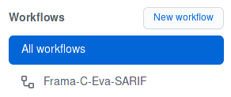

# Frama-C/Eva: sound analysis of possible runtime errors

The open-source [Frama-C](http://frama-c.com/) platform performs sound analyses
of C code bases based on different techniques.

This Github action uses the [Eva plug-in](http://frama-c.com/value.html)
for a mostly automatic analysis of runtime errors.
Its purpose is to extensively list all possible undefined behaviors in the code.

Note that, unlike many syntactic analyzers, Frama-C's deep semantic analysis
requires a considerable amount of information concerning the code and the
underlying architecture to give best results. Also, unlike *bug finders*,
which do not guarantee to be exhaustive, Frama-C intends to list *all* possible
issues in the code.

This action intends to help users already familiar with the platform to
automatically setup their C code bases so that Frama-C will run after each
commit.

If you are not familiar with the Frama-C platform, consider reading the
[Eva User Manual and Tutorial](http://frama-c.com/download/frama-c-eva-manual.pdf).

In technical terms, this action uses a
[Docker image of Frama-C](https://hub.docker.com/r/framac/frama-c/tags)
to parse and analyze a code base with Eva. After the analysis, it produces a
[SARIF](https://www.oasis-open.org/committees/tc_home.php?wg_abbrev=sarif)
report as artifact.

## Inputs

### `fc-dir`

Directory containing the Frama-C makefile. Default: `.frama-c`.

### `fc-makefile`

Name of the Makefile for Frama-C. Must be inside `fc-dir`.
Default: `GNUmakefile`.

### `eva-target`

**Required** Name of the Eva target in the Makefile. Default: `main.eva`.

## Outputs

### `alarm-count`

Number of alarms reported by Eva.

### `coverage`

Eva coverage estimation (%).

## Installation and usage

### Setting up the workflow on a C repository

#### With Frama-C 22 (or newer) installed

1. In the base directory of your C repository, run
   `frama-c-script make-template` to interactively fill an analysis
   template. It will be created in `.frama-c/GNUmakefile`.

2. Run the analysis, to make sure it works: `make <target>.eva`,
   where `<target>` is the name you chose when filling the template.
   If necessary, you can adjust `.frama-c/GNUmakefile` to fine-tune the
   analysis.

3. Copy the [workflow-example.yml](workflow-example.yml) file to your
   `.github/workflows/main.yml`, replacing `<target>` with the name you chose
   in step 1.

4. Commit the changes to your project, and push them to Github.

#### Without Frama-C installed (possible, but harder to setup if you never used Frama-C in your project)

1. Create a `.frama-c` directory in the root of your Github clone.

2. Copy a template Makefile from [here](https://git.frama-c.com/pub/frama-c/-/blob/master/share/analysis-scripts/template.mk) and put it in `.frama-c`.
   You should name it `GNUmakefile`.

3. Open the Makefile and replace `main.eva` with an appropriate name
   (e.g. `monocypher.eva`).
   Also rename `main.parse` accordingly (e.g. `monocypher.parse`) and
   add the list of sources, *relative to the `.frama-c` directory*
   (e.g. `monocypher.parse: ../file1.c ../file2.c ...`).

4. (Optional) If necessary, add preprocessing flags in `CPPFLAGS`.
   If you are familiar with Frama-C/Eva, you can also edit `EVAFLAGS` to
   improve precision, add stubs, etc.

5. Copy the [workflow-example.yml](workflow-example.yml) file to your
   `.github/workflows/main.yml`, replacing `<target>` with the name you chose
   in step 3.

6. Commit the changes to your project, and push them to Github.

### Viewing the results

You should see an Actions tab in your project, with the Frama-C/Eva workflow,
as in the image below.

After each push to `master`, Github will run the workflow.

If the action runs successfully, an artifact (report.sarif) will be available
for the run. You can open it using a SARIF viewer, such as Microsoft's
[VSCode plug-in](https://marketplace.visualstudio.com/items?itemName=MS-SarifVSCode.sarif-viewer).

You can also click on `run_eva`, in the left tab, to see a text log of the
entire run.

### Practical example

A practical example of usage of this action is available at the following repository:
https://github.com/maroneze/Monocypher

**Have fun with Frama-C !**
